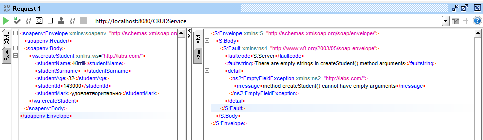

**Лабораторная работа 3**

# Обработка ошибок в SOAP-сервисе

## Задание

Основываясь на информации из раздела 2.8 добавить поддержку обработки ошибок в сервис, 
разработанный в Лабораторной работе 2 (см. `lab2_crud_ws`). 
Возможные ошибки, которые могут происходить при добавлении новых записей — например, 
неверное значение одного из полей, при изменении, удалении — попытка изменить или удалить несуществующую запись. 
Соответствующим образом необходимо обновить клиентское приложение.

## Ход работы

В разделе 2.8 приводится информация о том, как осуществить возврат сервисом информации об исключительной ситуации, что предполагает содержимое блока `soap:Fault`. Клиент при этом может проанализировать полученный код ошибки и сообщение. 

Для начала будем использовать SoapUI для тестирования возвращаемых сервисом ответом. 

Результат обработки ошибки - возврат сервисом SOAP-сообщения, содержащего `soap:Fault` с указанием информации об ошибке. Используется стандартный для Java подход к обработке исключений, т.е. использование ключевого слова `throw`, при этом в JAX-WS также делается наследование от класса java.lang.Exception, но требуется аннотация `@WebFault` с указанием в качестве параметра `faultBean` соответствующего класса, представляющего определенную ошибку. Пример аннотации для класса-исключения:

```java
@WebFault(faultBean="packageName.FaultBean")
```

 Класс исключения должен определять метод `getFaultInfo()`, возвращающий экземпляр `FaultBean` и иметь 2 конструктора: 

1. Конструктор с параметрами `String message, FaultBean fault`;
2. Конструктор с параметрами `String message, WebServiceFault fault, Throwable cause`.

Класс `FaultBean` должен определять метод String getMessage().

> Обозначенные выше правила обязательны для JAX-WS


### Изменения в классе StudentWebService

Теперь будем вносить изменения в ранее разработанный веб-сервис для обработки ошибок. 

Основной класс сервиса `StudentWebService` содержит веб-методы:

* getStudentsByFields()
* createStudent()
* deleteStudent()
* updateStudent()

Далее будем поочередно рассматривать обозначенные методы и добавлять к ним обработку ошибок. 


#### Метод getStudentsByFields()

Метод `getStudentsByFields()` - принимает в качестве параметров значения полей `@WebParam(name = "fieldValue") String[] searchArgs`  и возвращает `LinkedHashSet<Student>`, т.е. множество уникальных записей из таблицы БД, соответствующих классу `Student`.

Как и в случае любого другого поиска,  если не было передано аргументов для поиска, то возвращается пустое значение, в данном случае пустое множество `LinkedHashSet<Student>`, а ввиду того, что мы передаем значения в виде String и производим поиск по таблице БД с переводом поступивших параметров в текстовый вид, то дополнительной обработки ошибок здесь не понадобиться. Однако при необходимости можно реализовать возврат ошибки для случае, если аргументов в запросе не было. В итоге, для реализации обработки ошибки будем использовать последующие методы.


#### Метод createStudent()

Метод `createStudent()` - принимает в качестве параметров значения полей:

```java
@WebParam(name = "studentName") String name,
@WebParam(name = "studentSurname") String surname,
@WebParam(name = "studentAge") int age,
@WebParam(name = "studentId") int studentId,
@WebParam(name = "studentMark") String mark
```

Возвращает `String status`, т. е. строку с указанием статуса операции в виде нуля ("0" - операция не выполнена) или единицы ("1" - операция успешно выполнена) .

В данном методе нам обязательно нужно получить все параметры (поля записи) и выбросить исключение, если не было задано значения какого-либо аргумента. С другой стороны, значения `studentAge` и `studentId` должны иметь возможность приведения к целым числам, а `studentMark` принимать значения `неудовлетворительно, удовлетворительно, хорошо, отлично`. В соответствии с этим, рассмотрим следующие случаи исключительных ситуаций:

* Если отсутствует значение для какого-либо из параметров;
* Если значение для параметров  `studentAge` и `studentId` не могут быть приведены к целочисленному типу данных (int);
* Если значение `studentMark` отличается от возможных: `неудовлетворительно, удовлетворительно, хорошо, отлично`.

Для каждого обозначенного случая будем возвращать соответствующее исключение.

Учитывая, что ранее мы пытались подобные случаи рассматривать в консольном клиенте данного веб-сервиса, то будем вносить соответствующие изменения сначала в часть самого сервиса, а затем и в часть клиента. Тип данных для `age` и `studentId` теперь изменим также на String. Чтобы обрабатывать подобные исключения на стороне сервиса.

Проверки на наличие ошибок в данном случае будут вложенными, т. е. изначально проверяем на наличие пустых параметров, если их нет, то проверяем на возможность привести параметры `age` и `studentId` к целым числам, а затем на наличие одного из возможных значений параметра mark.

Реализуем проверку на пустые поля метода createStudent() и будет выбрасывать соответствующее исключение, причем сразу отключим возврат stacktrace в ответе сервиса. В итоге, при запросе через SoapUI получим следующий ответ:



В класс StudentWebService в метод createStudent() мы добавили проверку:

```java
if (name != null && !name.trim().isEmpty() &&
                surname != null && !surname.trim().isEmpty() &&
                age != null && !age.trim().isEmpty() &&
                studentId != null && !studentId.trim().isEmpty() &&
                mark != null && !mark.trim().isEmpty()) {
    ...
} else {
    CRUDServiceCreateStudentEmpryFieldFault fault = CRUDServiceCreateStudentEmpryFieldFault.defaultInstance();
    throw new EmptyFieldException("There are empty strings in createStudent() method arguments", fault);
}

```

В соответствии с этим, если мы обнаружили, что какой-либо из параметров содержит пустую строку или строку из пробелов, то мы выбрасываем исключение `EmptyFieldException` с соответствующим сообщением и объектом `faultBean = "com.labs.errors.CRUDServiceCreateStudentEmptyFieldFault"`, заданным в аннотации `@WebFault`. 

Подобным образом мы будем обрабатывать все исключительные ситуации, поэтому далее ограничимся лишь обозначение того, какие исключительные ситуации необходимо обработать.


#### Метод deleteStudent()

Метод `deleteStudent()` - принимает в качестве параметров значение идентификатора записи в таблице в БД `@WebParam(name = "rowId") int rowId`  и возвращает `String status`, т. е. строку с указанием статуса операции в виде нуля ("0" - операция не выполнена, т. е. в таблице в БД не было записи с указанным идентификатором, или идентификатор имеет неверный формат - не может быть приведен к целому числу) или единицы ("1" - операция успешно выполнена). 

* В случаях, когда возвращается статус "0" будем выбрасывать исключение о том, что в таблице в БД не было записи с указанным идентификатором.

* В случае, когда rowId нельзя привести к целому числу мы не будем делать запрос к БД, а сразу будем выбрасывать соответствующее исключение. 


#### Метод updateStudent()

Метод `updateStudent()` - принимает в качестве параметров значения полей, причем данный метод может принимать как отдельные значения для изменения, так и все значения для полного изменения записи:

```java
@WebParam(name = "rowId") int rowId,
@WebParam(name = "studentName") String name,
@WebParam(name = "studentSurname") String surname,
@WebParam(name = "studentAge") int age,
@WebParam(name = "studentId") int studentId,
@WebParam(name = "studentMark") String mark
```

Возвращает `String status`, т. е. строку с указанием статуса операции в виде нуля ("0" - операция не выполнена) или единицы ("1" - операция успешно выполнена) .

Итак, для обновления записи в БД нам потребуется в обязательном порядке rowId и хотя бы одно из значений для полей записи, причем `studentAge, studentId`  должно быть возможно привести к целым числам. 

* Если отсутствует rowId или он не является числом, то мы возвращаем исключение;
* Если все остальные поля пустые, то также возвращаем соответствующее исключение;
* Если `studentAge, studentId` невозможно привести к целому числу, то также возвращаем исключение.


### Изменения в классе App

Для того, чтобы не выводился полный stacktrace, необходимо добавить свойство в класс App следующим образом:

```java
public class App {
    ...
    // disable stacktraces in soap-message
	System.setProperty("com.sun.xml.ws.fault.SOAPFaultBuilder.disableCaptureStackTrace", "false");
	...
}
```


## Обновление клиентского приложения

Изначально сгенерируем новые классы по WSDL-описанию:

```shell
wsimport -keep -p com.labs.client.generated http://localhost:8080/CRUDService?wsdl
```